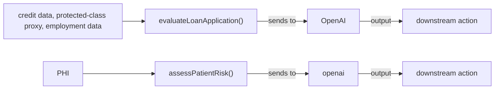

# AI System Data Flow Diagram

**Project:** test-healthtech-fintech-app  
**Generated:** 2026-06-25 by RegKit AGENT-5  
**Source:** automated scan of 1 file(s)  

> **Disclaimer:** This document was auto-generated by RegKit from a static + reasoning scan of source code. It is a compliance-intelligence draft, not legal advice, and not a substitute for review by qualified legal counsel. Sections marked _[HUMAN COMPLETION REQUIRED]_ contain determinations RegKit cannot make from code alone.

## Purpose

This diagram maps every point where this codebase sends data to an AI model, what kind of data flows through each point, and which compliance obligations attach. It satisfies the first question every regulator, auditor, and enterprise security team asks: *what data goes into your AI, and where does the output go?*

It is referenced by EU AI Act Art. 10 (data governance), HIPAA audit investigations, SOC 2 CC6.6, and enterprise security questionnaires.

## Flow Diagram

## Data Flow Inventory

| AI Touchpoint | Location | Vendor / Model | Data Sensitivity | Line |
|---|---|---|---|---|
| `evaluateLoanApplication()` | test-fixtures/patient-risk-assessment.js | OpenAI | ⚠️ credit data, protected-class proxy, employment data | 22 |
| `assessPatientRisk()` | test-fixtures/patient-risk-assessment.js | openai | ⚠️ PHI | 12 |

## Compliance Obligations Attached to These Flows

- **GDPR** (Regulation (EU) 2016/679, Article 22) — Decisions with legal/significant effect highlighted
- **HIPAA** (45 CFR § 164.502(e), § 164.504(e)) — Third-party data disclosure points
- **Illinois HB 3773 (IHRA Amendment)** (775 ILCS 5/2-102, as amended by P.A. 103-804 (HB 3773)) — Employment-decision AI flagged with IL notice status
- **NYC Local Law 144** (NYC Admin. Code § 20-870 et seq.; implementing rules at 6 RCNY § 5-300 et seq.) — Hiring/promotion AEDT flagged with audit currency status
- **ECOA/Regulation B + FCRA/Regulation V** (12 CFR § 1002.9 (Reg B); 15 U.S.C. § 1681m, 12 CFR Part 1022 § 615 (Reg V/FCRA)) — Credit-decision systems flagged with adverse-action notice compliance status
- **California CCPA ADMT Regulations** (Cal. Code Regs. tit. 11, §§ 7200-7222) — California ADMT significant-decision systems flagged separately from GDPR Art. 22 systems

