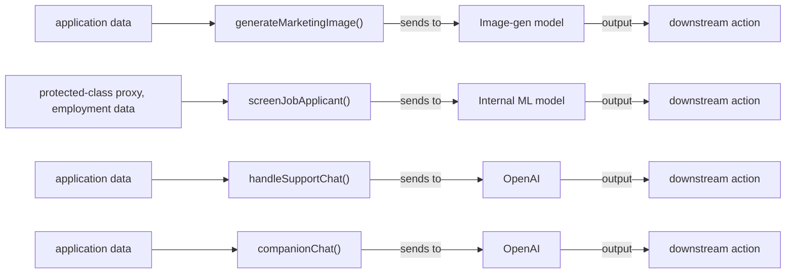

# AI System Data Flow Diagram

**Project:** multi-state-test  
**Generated:** 2026-06-23 by RegKit AGENT-5  
**Source:** automated scan of 1 file(s)  

> **Disclaimer:** This document was auto-generated by RegKit from a static + reasoning scan of source code. It is a compliance-intelligence draft, not legal advice, and not a substitute for review by qualified legal counsel. Sections marked _[HUMAN COMPLETION REQUIRED]_ contain determinations RegKit cannot make from code alone.

## Purpose

This diagram maps every point where this codebase sends data to an AI model, what kind of data flows through each point, and which compliance obligations attach. It satisfies the first question every regulator, auditor, and enterprise security team asks: *what data goes into your AI, and where does the output go?*

It is referenced by EU AI Act Art. 10 (data governance), HIPAA audit investigations, SOC 2 CC6.6, and enterprise security questionnaires.

## Flow Diagram

## Data Flow Inventory

| AI Touchpoint | Location | Vendor / Model | Data Sensitivity | Line |
|---|---|---|---|---|
| `generateMarketingImage()` | test-fixtures/state-laws-test.js | Image-gen model | standard | 22 |
| `screenJobApplicant()` | test-fixtures/state-laws-test.js | Internal ML model | ⚠️ protected-class proxy, employment data | 15 |
| `handleSupportChat()` | test-fixtures/state-laws-test.js | OpenAI | standard | 35 |
| `companionChat()` | test-fixtures/state-laws-test.js | OpenAI | standard | 46 |

## Compliance Obligations Attached to These Flows

- **California AI Transparency Act (SB 942 / AB 853, 'CAITA')** (Cal. Bus. & Prof. Code §§ 22757-22757.4) — GenAI media generation endpoints flagged with SB 942 disclosure status
- **Illinois HB 3773 (IHRA Amendment)** (775 ILCS 5/2-102, as amended by P.A. 103-804 (HB 3773)) — Employment-decision AI flagged with IL notice status
- **NYC Local Law 144** (NYC Admin. Code § 20-870 et seq.; implementing rules at 6 RCNY § 5-300 et seq.) — Hiring/promotion AEDT flagged with audit currency status
- **Multi-state AI chatbot disclosure and companion safety laws** (CA Bus. & Prof. Code §§ 22601-22606 (SB 243, eff. Jan 1, 2026) | WA HB 2225 (eff. Jan 1, 2027) | OR SB 1546 (eff. Jan 1, 2027) | NE LB 525, "Conversational AI Safety Act" (eff. Jul 1, 2027) | ID SB 1297 (eff. Jul 1, 2027) | IA SF 2417 (eff. Jul 1, 2026) | GA SB 540 (status: awaiting gubernatorial action as of source date — AGENT-7 must confirm signature status before treating as enacted)
) — Consumer-facing chat interfaces flagged with applicable state disclosure regime
- **Washington HB 1170** (2026 Wn. Sess. Laws, HB 1170 (2nd Substitute, as enrolled)) — Cross-referenced alongside California SB 942 findings for the same generation endpoints, since many customers will be dual-covered

